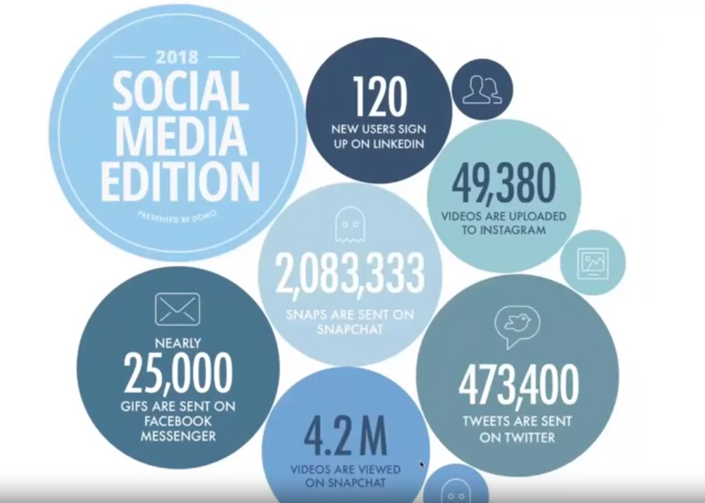
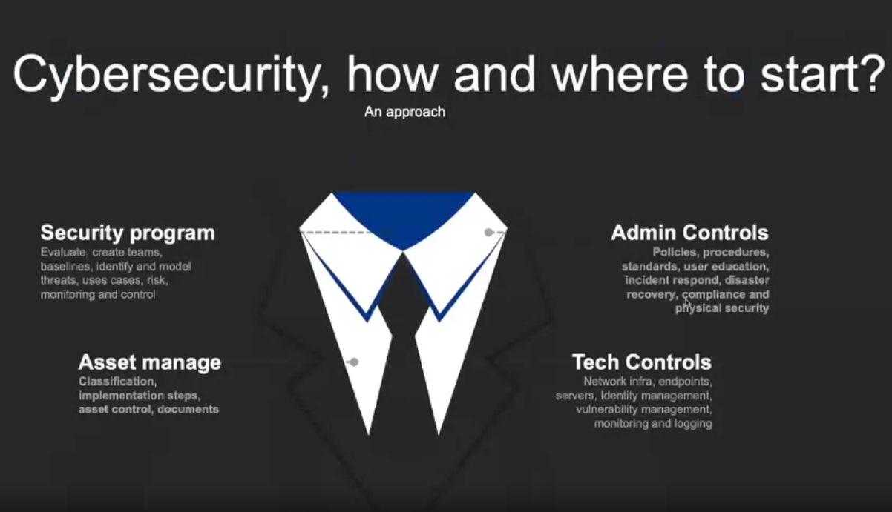
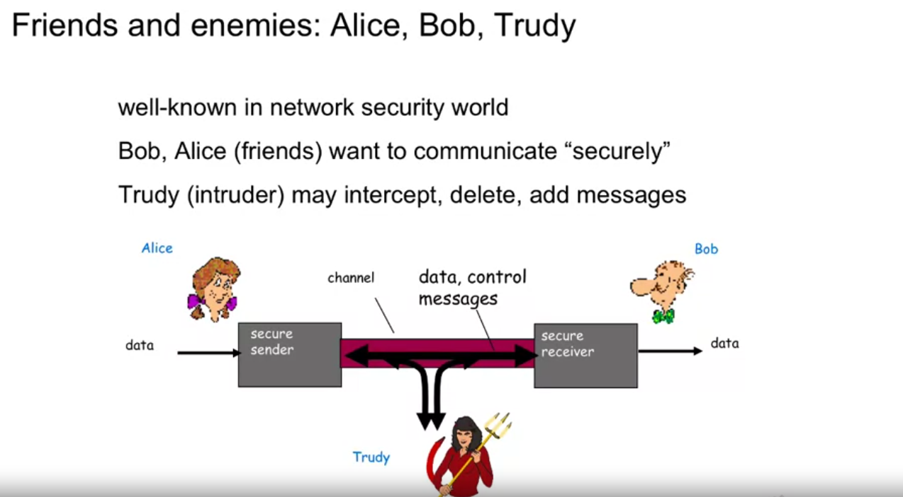
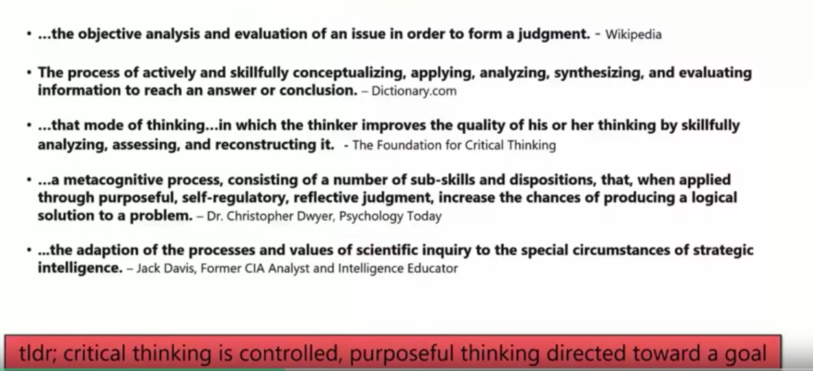
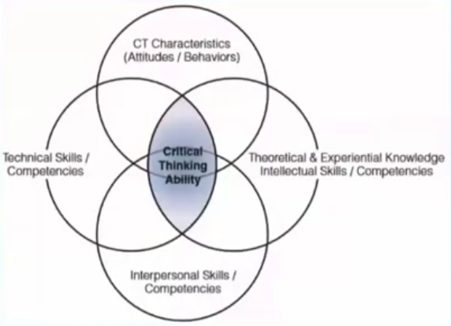

# IBM Cybersecurity Analyst Professional Certificate

## 1/8 Introduction to Cybersecurity Tools & Cyber Attacks

### Week 1: History of Cybersecurity

#### Learning Objectives

* Define cybersecurity and describe key terms and key security roles and functions within an IT organization.
* Describe the history of cybersecurity and what events brought it into the national spotlight in the United States.
* Describe why critical thinking is such an important skill for the security analyst to posses in the rapidly evolving cyberattack landscape.
* Describe why it is so hard to secure online resources and what organizations and resources are available to help.

#### Introduction to Cybersecurity Tools & Cyber Attacks

by 2022, there will be 1.8 million unfulfilled cybersecurity jobs

[SME List (PDF)](pdf/Your-IBM-Subject-Matter-Experts--Intro-to-Cybersecurity-tools.pdf)

#### What are We Talking about when We Talk about Cybersecurity?

**N**ational **I**nstitute of **S**tandards and **T**echnology, definition of cybersecurity: *The protection of information systems from unauthorized access, use, disclosure, disruption, modification, or destruction in order to provide confidentiality, integrity, and availability*

**Information Security -> Confidentiality + Integrity + Availability = CIA triad**
* **Confidentiality** - synonymous with privacy. Confidentiality measures prevent data from falling into the hands of people who do not have authorization to access said information. (e.g. encryption)
* **Integrity** - information is - and remains - accurate. (e.g. hash values)
* **Availability** - requires routine maintenance and upgrading of hardware and software. (e.g. firewalls, proxies; business continuity plans, disaster recovery, redundancy)

Other Key terms:
* **Vulnerability** - a flaw, loophole, oversight, or error that can be exploited to violate system security policy. (e.g buffer overflow exploit)
* **Threat** - an event, natural or manmade, able to cause negative impact to an organization.
* **Exploit** - a way to breach the security of an IT system through a vulnerability.
* **Risk** - probability of an event involving exposure to danger.

A **vulnerability assessment** is a search for weaknesses and exposures in order to fix or prevent a compromise.
* many systems are shipped with known and unknown security flaws, bugs, and insecure default settings
* human error / system administrator misconfiguration happens

**Roles in Information Security**
* Chief Information Security Officer (CISO)
* Information Security Architect
* Information Security Consultant/Specialist
* Information Security Analyst
* Information Security Auditor (ISO 27001-2)
* Security Software Developer
* Penetration Tester / Ethical Hacker (red team)
* Vulnerability Assessor
* Digital Forensic Analyst (blue team)
* SIEM Engineer

#### From Ronald Reagan to Where we are Today

**Reagan**

National Policy on Telecommunications and Automated Information Systems Security
[NSDD 145](https://irp.fas.org/offdocs/nsdd145.htm)

**pre- and post- 9/11**

**Now**
* New Freedom Act
* 2016 - 10,200 Software Vulnerabilities and growing exponentially
* Cybercrime is $400 billion/year+ business
* [IBM X-force threat intelligence report](https://www.ibm.com/security/data-breach/threat-intelligence/)

#### Cybersecurity Programs

Every Minute (2018):

[How much is your data worth?](https://calc.datum.org)

**Online Security**
* *Data Protection* - multiple types of data and multiple ways of protecting it
* *Global Business* - not just one office in one country, not just one set of laws or compliance requirements
* *Mobile Tech* - increasing amount of confidential data in smartphones, other mobile devices, and in the cloud
* *Multiple Vendors* - need to be able to communicate in one or many languages

* [2018 - data being used every minute](https://www.entrepreneur.com/article/314672)
* [2021 - top 10 data and analytics trends](https://www.gartner.com/smarterwithgartner/gartner-top-10-data-and-analytics-trends-for-2021)

#### Cybersecurity - A Security Architect's Perspective

**Confidentiality**
* only the sender and intended receiver should understand message contents
* sender encrypts, receiver decrypts

**Authentication**
* sender/receiver want to confirm identity of other

**Message Integrity**
* sender/receiver want to ensure that the message is unaltered in transit or afterwards without detection

**Access and Availability**
* services must be accessible and available to users

*The art of war teaches us to rely not on the likelihood of the enemy's not coming, but on our own readiness to receive him; not on the chance of his not attacking, but rather on the fact that we have made or position unassailable*
     **-- The Art of War, Sun Tzu**
	 
*The combination of space, time, and strength that must be considered as the basic elements of this theory of defense makes this a fairly complicated matter. Consequently, it is not easy to find a fixed point of departure.*
	**-- On War, Carl Von Clausewitz**
	

* client-server relationship
* DNS servers
* routers exchanging ip tables
* firewalls communicating with security intelligence systems

**Computer Security defined by NIST**
* the protection afforded to an automated information system in order to attain the applicable objectives of preserving the integrity, availability, and confidentiality of information system resources which includes hardware, software, firmware, information/data, and telecommunications.

**Computer Security Challenges**
* Security is not as simple as it seems
	* easy requirements, hard solutions
* Security policy enforcement structures can be targets of attack
* Protecting enforcement structures can complicate solutions further
* Where do we deploy security solutions?
* Cryptographic key management is hard
* Protectors have to be right every time, attackers just once
* No one likes security until it is needed (seatbelt philosophy)
* Security is often viewed as something that is a barrier, in-the-way of doing business
* Security is often not part of early application development, not "baked in"
* Security needs to be agile

#### What is Critical Thinking?

Kristin S. Dahl - Beyond Technology

* Critical thinking forces us to think and act in situations where there are no clear answers nor specific procedures.
* Google and internet-based knowledge can overwhelm our abilities to think critically through problems

**Cybersecurity - Technical Skills**
* intrusion detection
* reverse engineering
* programming
* virtualization
* cryptography
* networking
* operating systems
* database modeling

The tools and threat landscape change quickly, but the security fundamentals change slowly.

critical thinking + understanding fundamentals will allow us to identify solutions to unknown, undefined, and complex situations - regardless of changes in technology

**Critical Thinking - 5 Key Skills**
1. *challenge assumptions*
	* question the mental model that underlies your reasoning
3. *consider alternatives*
	* avoid letting yourself become entrenched in one explanation
	* who what where when why how
5. *evaluate data*
	* assess the data against multiple hypotheses to see how well it fits
7. *identify key drivers*
	* technology, regulatory, society, supply chain, employees, threat actors
9. *understand context*
	* what is the operational environment?
	* what is perspective of managers, colleagues, and clients?
	* put yourself in others' shoes - reframe the problem

#### Top Cybersecurity Organizations you will want to explore

* [WiCys Organization](https://www.wicys.org/about) | [Resources](https://www.wicys.org/resources)
* [The SANS Institute](https://www.sans.org/) | [Critical Security Controls](https://www.sans.org/critical-security-controls/)
* [OWASP - The Open Web Application Project](https://owasp.org/projects/)
* [ISSA - Information Systems Security Association](https://www.issa.org/) | ["Smart Cities and Privacy"](https://cdn.ymaws.com/www.members.issa.org/resource/resmgr/journalpdfs/feature0619.pdf)
* [FIRST - Forum of Incident Response and Security Teams](https://www.first.org/membership/benefits) | [Service Framework](https://www.first.org/education/service-framework)
* [Additional Cybersecurity Industry Associations](https://cybersecurityventures.com/cybersecurity-associations/#home/?view_1_page=1) | ["Top 5 Cybersecurity Facts, Figures, Predictions, And Statistics For 2019 To 2021"](https://cybersecurityventures.com/top-5-cybersecurity-facts-figures-predictions-and-statistics-for-2019-to-2021/)

### Week 2: A Brief Overview of Types of Actors and Their Motives

#### Types of 
