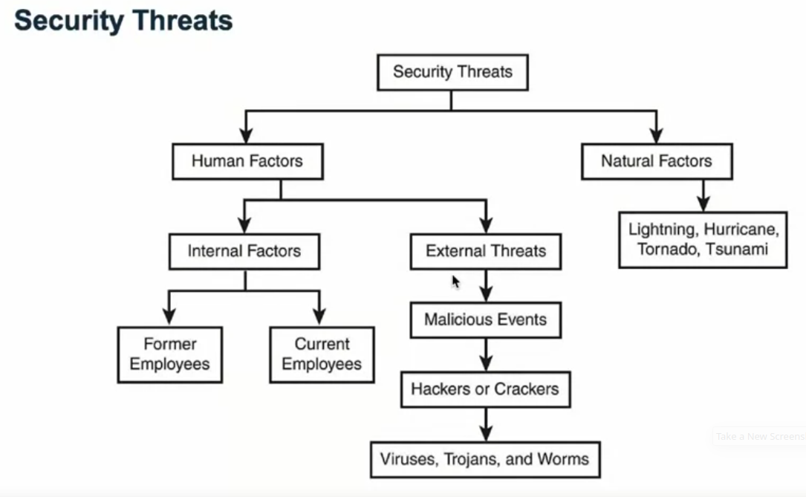

# IBM Cybersecurity Analyst Professional Certificate

## Introduction to Cybersecurity Tools & Cyber Attacks

### Week 1: History of Cybersecurity

#### Learning Objectives

* Define cybersecurity and describe key terms and key security roles and functions within an IT organization.
* Describe the history of cybersecurity and what events brought it into the national spotlight in the United States.
* Describe why critical thinking is such an important skill for the security analyst to posses in the rapidly evolving cyberattack landscape.
* Describe why it is so hard to secure online resources and what organizations and resources are available to help.

#### Introduction to Cybersecurity Tools & Cyber Attacks

by 2022, there will be 1.8 million unfulfilled cybersecurity jobs

[SME List (PDF)](pdf/Your-IBM-Subject-Matter-Experts--Intro-to-Cybersecurity-tools.pdf)

####What are We Talking about when We Talk about Cybersecurity?

**N**ational **I**nstitute of **S**tandards and **T**echnology, definition of cybersecurity: *The protection of information systems from unauthorized access, use, disclosure, disruption, modification, or destruction in order to provide confidentiality, integrity, and availability*

Information Security -> Confidentiality + Integrity + Availability = CIA triad

* **Confidentiality** - synonymous with privacy. Confidentiality measures prevent data from falling into the hands of people who do not have authorization to access said information. (e.g. encryption)
* **Integrity** - information is - and remains - accurate. (e.g. hash values)
* **Availability** - requires routine maintenance and upgrading of hardware and software. (e.g. firewalls, proxies; business continuity plans, disaster recovery, redundancy)

Other Key terms:

* **Vulnerability** - a flaw, loophole, oversight, or error that can be exploited to violate system security policy. (e.g buffer overflow exploit)
* **Threat** - an event, natural or manmade, able to cause negative impact to an organization.
* **Exploit** - a way to breach the security of an IT system through a vulnerability.
* **Risk** - probability of an event involving exposure to danger.

#### From Ronald Reagan to Where we are Today

#### Cybersecurity Programs

#### Cybersecurity - A Security Architect's Perspective

#### What is Critical Thinking?

#### Top Cybersecurity Organizations you will want to explore

#### Summary 
